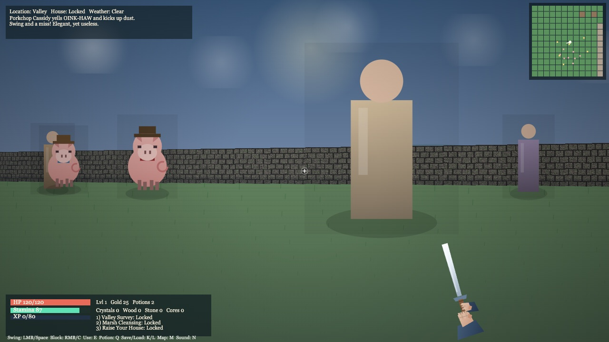

# WestWardRPG


WestWardRPG is a browser-first RPG sandbox with raycast combat, quest progression, dynamic weather, and intentionally goofy pig chaos.
Built with plain web tech so the game logic stays transparent, hackable, and fast to iterate.

> Repo bio: "A first-person browser RPG where steel clashes, quests chain together, and pigs occasionally steal the spotlight."

## Gameplay Preview

<p align="center">
  
</p>

In-game valley scene with HUD, minimap, and sword combat view.

## Code Language Variety

- **JavaScript**: core game loop, rendering, combat, AI, and save/load.
- **TypeScript**: typed atmosphere math module (`atmosphere.ts`) used by the renderer.
- **Python**: utility tooling for scenario snapshot reports (`scripts/state_report.py`).
- **Go**: high-performance map data validation (`scripts/map_validator.go`).
- **Rust**: efficient texture analysis and processing (`scripts/texture_analyzer.rs`).
- **Ruby**: asset bundling and manifest generation (`scripts/asset_bundler.rb`).
- **Shell**: development automation and build tooling (`scripts/dev_tools.sh`).
- **Perl**: log analysis and statistics (`scripts/log_analyzer.pl`).
- **PHP**: web server configuration generator (`scripts/config_generator.php`).
- **HTML5**: canvas shell, HUD structure, and menu wiring (`index.html`).
- **CSS**: in-page UI/HUD styling for responsive overlays (`index.html` styles).
- **JSON**: deterministic test-action scripts for automation (`test-actions/*.json`).
- **Markdown**: repository docs and contributor guidance (`README.md`, `CONTRIBUTING.md`).
- **Shell/CLI**: command-driven dev workflow (`npm`, `node`, `python3`, `git`).

## Why This Repo Shines

- Fast, framework-free raycast 3D renderer.
- Crunchy melee combat: combo swings, block timing, stamina pressure.
- Full quest loop: gather, fight, craft, build your house.
- Dynamic atmosphere: day/night cycle + weather states.
- Save/load + autosave for longer play sessions.
- Built-in **multi-language support**: English, Español, Português, Français, Deutsch, Italiano, 日本語, Türkçe.
- Automation hooks for deterministic testing and Playwright action runs.

## Gameplay Features

- **World & Rendering**: textured raycast walls, fog, weather overlays, minimap.
- **Combat**: attack chains, enemy pursuit, hit reactions, death/recovery flow.
- **Progression**: XP/level curve, gold economy, potions, resource harvesting.
- **Quest Arc**: 3-step progression from survey → cleanse marsh → build house.
- **Settlement Life**: NPC interactions, shop, inn vibes, bard lines, pig chaos.

## Language Support

Use the language selector in the main menu.

- `English` (`en`)
- `Español` (`es`)
- `Português` (`pt`)
- `Français` (`fr`)
- `Deutsch` (`de`)
- `Italiano` (`it`)
- `日本語` (`ja`)
- `Türkçe` (`tr`)

Language preference is persisted in localStorage.

## Controls

- Move: `WASD` or Arrow keys
- Look: Mouse (pointer lock) or Arrow Left/Right
- Attack: Left Mouse or `Space`
- Block: Right Mouse or `C`
- Interact: `E` or `Enter`
- Use Potion: `Q`
- Quick Save / Load: `K` / `L`
- Toggle Map: `M`
- Toggle Sound: `N`
- Fullscreen: `F`

## Quick Start

### Requirements

- Node.js 16+
- Python 3

### Install

```bash
npm install
```

### Run

```bash
npm run start
```

Open: [http://127.0.0.1:5173/index.html](http://127.0.0.1:5173/index.html)

## Testing & Validation

### Syntax Check

```bash
npm test
```

### TypeScript Check

```bash
npm run typecheck:ts
```

### Scenario State Report (Python)

```bash
npm run report:states
```

### Development Tools (Shell)

```bash
# Check dependencies
npm run dev:check

# Run all linters
npm run dev:lint

# Full pipeline (check, lint, build, test)
npm run dev:full
```

### Asset Management (Ruby)

```bash
# Generate asset manifest with checksums
npm run bundle:assets

# Verify asset integrity
npm run verify:assets
```

### Log Analysis (Perl)

```bash
# Analyze output logs and generate statistics
npm run analyze:logs

# Output as JSON
perl scripts/log_analyzer.pl output json
```

### Server Configuration (PHP)

```bash
# Generate nginx configuration
npm run config:nginx

# Generate Apache configuration
npm run config:apache

# Generate Caddy configuration
php scripts/config_generator.php -t caddy
```

### Map Validation (Go)

```bash
# Validate map JSON structure (requires Go)
go run scripts/map_validator.go <map-file.json>
```

### Texture Analysis (Rust)

```bash
# Analyze texture data (requires Rust)
rustc scripts/texture_analyzer.rs -o texture_analyzer
./texture_analyzer <texture-data-file>
```

### Example Playwright Scenario

```bash
node ./web_game_playwright_client.mjs \
  --url http://localhost:5173 \
  --actions-file ./test-actions/quest_flow.json \
  --click-selector "#start-btn" \
  --iterations 2 \
  --pause-ms 250 \
  --screenshot-dir output/web-game-quest
```

## Project Layout

- `index.html` - game shell, menu UI, language selector
- `game.js` - core systems (rendering, combat, AI, quests, saves)
- `web_game_playwright_client.mjs` - automation runner for scenarios/screenshots
- `test-actions/` - scripted gameplay action sets
- `output/` - captured screenshots + JSON snapshots from runs
- `progress.md` - development log and iteration notes

## Repository Links

- Repo: [https://github.com/coleyrockin/WestWardRPG](https://github.com/coleyrockin/WestWardRPG)
- Issues: [https://github.com/coleyrockin/WestWardRPG/issues](https://github.com/coleyrockin/WestWardRPG/issues)
