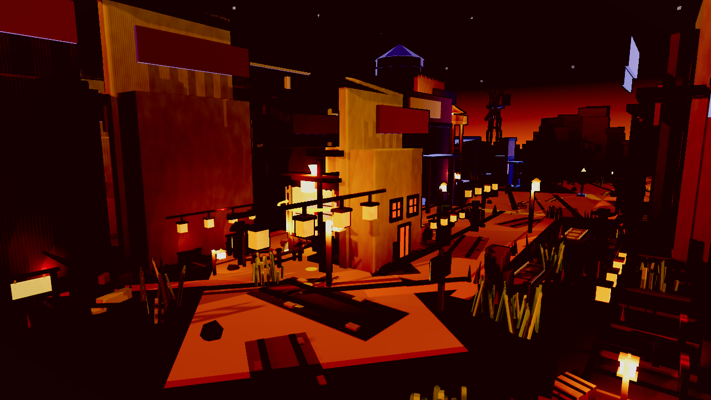

# WestWard

A story-first western RPG rendered as a low-poly graphic novel — *Oblivion meets Weird West meets an inked comic* — built in Three.js with Blender-authored models, playable in the browser.

[](https://github.com/coleyrockin/WestWardRPG/actions/workflows/qa.yml)


**[▶ Play now](https://westward-rpg.vercel.app)** · [Roadmap](ROADMAP.md)

---



---

## What this is

Most indie RPGs are systems demos — procedural dungeons, a combat sandbox, loot tables — with a thin story bolted on at the end. WestWard inverts that. The authored narrative — Marshal Boone's job board, the first-road bounty chain, NPC memory, faction-shaded decisions — is the product. Combat and the economy exist to put pressure on decisions; they're the stakes, not the point.

The renderer is an **NPR cel-shader** (WebGPU + TSL, WebGL2 fallback): ink edges from depth discontinuity, flat cel banding, bloom + split-tone grade, a continuous day/night arc, and Blender-authored low-poly models. The visual direction is committed — graphic-novel illustration, not photoreal. Confident silhouettes and dramatic light are achievable at this scale where photorealism never will be.

The current playable build is the **first-road loop**: spawn into Dustward at golden hour, take the Marsh Slime Bounty from Boone's board, follow the road east past the smoke cache, fight the road slime, salvage the broken wagon, and bring the map scrap back. Wind, footsteps, harmonica sting, and slime SFX are live (Web Audio, no assets).

---

## Installation

Node 22 required (matches CI).

```bash
git clone https://github.com/coleyrockin/WestWardRPG.git
cd WestWardRPG
npm ci
npm run dev
```

Open the Vite URL — the game boots at `/`.

---

## Usage

### Playing

From the title screen, ride in. The opening drops you into Dustward at golden hour:

1. Find **Marshal Boone's job board** at the board plaza
2. Follow the **Marsh Slime Bounty** east toward the smoke cache
3. Fight the road slime in the marsh clearing
4. Salvage the **broken wagon** for map scrap
5. Return to Boone

**Controls:** `WASD` move · `Shift` run · `Space` dodge · `E` use · `F` draw weapon · `M` mute

### Dev tooling

The `window.__spike` harness is available from the browser console:

```js
__spike.goto('roadSlime')     // teleport to a story beat
__spike.setPos(x, y)          // place hero at world coords
__spike.setPalette({ grade: { splitStrength: 0.6 } })  // live palette tweak
__spike.setLight('sun', { intensity: 3.0 })
__spike.captureMode()         // freeze clock + weather for screenshots
__spike.dumpLook()            // print current lighting/grade as JSON
```

### Verification gate

Run before every commit:

```bash
npm test && npm run typecheck:ts && npm run dev:lint && npm run build
```

With a dev server running:

```bash
WESTWARD_URL=http://127.0.0.1:5180 npm run test:render3d   # first-road loop smoke
WESTWARD_URL=http://127.0.0.1:5180 npm run test:visual     # golden-image gate (dusk pinned)
```

---

## Tech stack

| Layer | Choice | Why |
|---|---|---|
| Renderer | Three.js r184, `WebGPURenderer` + TSL | One shader graph → WGSL and GLSL from the same source; WebGL2 fallback keeps older GPUs running |
| Models | Blender → `.glb` (`tools/blender/`, `public/models/`) | Hand-authored low-poly hero assets; silhouette over detail |
| Build | Vite 6 | Single-entry game at `/`; fast dev loop |
| Tests | Vitest 4, `environment: "node"` | Pure logic modules tested headless; no jsdom, no WebGL in tests |
| Types | TypeScript (noEmit check only) | Type-checks the test layer; pure JS modules stay lean |
| Smoke | Playwright scripts | First-road loop replay + pixelmatch golden image |
| Language | Plain JS | No framework. The renderer is the framework. |
| Deploy | Vercel (auto on push to `main`) | Zero config; `vercel.json` handles CSP + static caching |

The NPR shader stack: `nprMaterial.js` (TSL cel ramp + Fresnel rim), `postStacks.js` (Sobel ink edges + bloom + split-tone grade + vignette), `atmosphere.js` (sky dome + lights + fog, palette-driven), `timeOfDay.js` (goldenHour / dusk / night palettes + `sunArc` continuous arc).

---

## Project structure

```
index.html             ← the game shell (HUD DOM, title screen)
src/
├── render3d/          ← the game: scene, loop, state
│   ├── spike.js       ← scene assembly, render loop, building/prop builders
│   ├── gameState.js   ← RPG state tree
│   ├── phaseState.js  ← first-road loop state machine
│   ├── audioView.js   ← Web Audio layer (wind, footsteps, stings)
│   ├── frontierLayout.js  ← world map: coordinates, beat route
│   └── combat/        ← player combat, slime behavior, hit FX
├── game/
│   ├── renderer/      ← materials, post stacks, .glb asset pipeline
│   └── world/         ← ground, water, scatter, weather, townsfolk
└── [engine modules]   ← jobBoard, lootSystem, progression, npcMemory,
                         savePersistence… pure logic, unit-tested
public/models/         ← Blender-authored .glb assets
tests/                 ← 536 Vitest tests across 52 files
```

---

## Contributing

See [CONTRIBUTING.md](CONTRIBUTING.md). The short version: run `npm run qa` before opening a PR, keep engine modules pure (no WebGL/DOM in unit-tested files), and read `CLAUDE.md` for the guardrails (layout tests, golden-image baseline, hero-object routes).

---

## License

MIT — see [LICENSE](LICENSE).
