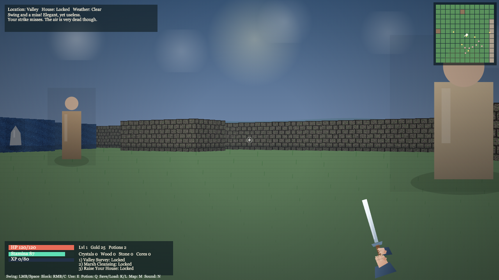

# WestWardRPG


A first-person western RPG that runs in a single HTML file — raycast 3D renderer, melee combat, quest progression, dynamic weather, boid-flocked pig outlaws, and save/load. No frameworks, no engine, no build step: the rendering, physics, AI, and UI are all transparent in one readable codebase.



## Demo

Clone and run locally (see [Getting Started](#getting-started)) — the game is a static `index.html` and works offline.

[](https://vercel.com/new/clone?repository-url=https://github.com/coleyrockin/WestWardRPG)

One-click deploy to Vercel (zero configuration required thanks to `vercel.json`), or use any static host (GitHub Pages, Netlify, Cloudflare Pages).

---

## Features

- **Raycast 3D renderer** — framework-free first-person view with textured walls and sprites
- **Melee combat system** — combo swings, block timing, stamina pressure, and enemy AI
- **Full quest loop** — gather, fight, craft, and build your house
- **Dynamic atmosphere** — day/night cycle with weather states (rain, fog, clear)
- **Pig chaos** — eight named outlaw pigs with boid-flocking AI, stampede triggers, and pickpocketing
- **Save/load + autosave** — persistent progress for longer play sessions
- **Multi-language support** — English, Español, Português, Français, Deutsch, Italiano, 日本語, Türkçe
- **Deterministic test automation** — JSON-driven action scripts for CI validation

## Tech Stack

| Category | Technologies |
|----------|-------------|
| **Core Engine** | JavaScript ES6+, HTML5 Canvas |
| **Typed Modules** | TypeScript (atmosphere math) |
| **Scripting** | Python (balance tuning, test harness) |
| **Build Tools** | Shell, Ruby (bundler), Perl (log analysis), PHP (config generator) |
| **Testing** | Vitest unit tests, Playwright E2E, JSON action scripts, shell smoke suite |
| **Deployment** | Static HTML — no server required |

## Getting Started

```bash
# Clone the repository
git clone https://github.com/coleyrockin/WestWardRPG.git

# Navigate to the project
cd WestWardRPG

# Install dependencies
npm install

# Start the development server
npm run dev
```

Open the printed local URL to play. No build step required for the base game — just open `index.html` in a browser.

### Running the test suite

```bash
npm test            # Vitest unit tests
npm run test:smoke  # Playwright end-to-end smoke scenarios
npm run typecheck:ts
```

## Controls

| Action | Key |
|--------|-----|
| Move | `W` `A` `S` `D` |
| Look | Mouse |
| Attack | Left click |
| Block | Right click / `Shift` |
| Interact | `E` |
| Inventory | `I` |
| Quest log | `Q` |
| Save | `F5` |
| Load | `F9` |

## Project Structure

```
WestWardRPG/
├── index.html                     # Game entry point and HUD
├── game.js                        # Core game loop, rendering, combat, AI, quests
├── atmosphere.ts / atmosphere.js  # Typed atmosphere math (TS source + compiled JS)
├── web_game_playwright_client.mjs # Playwright action-script runner
├── scripts/                       # Dev tools (Shell, Python, Ruby, Perl, PHP, Rust, Go)
├── test-actions/                  # Deterministic JSON test scripts
├── test-data/                     # Fixtures for map and texture validators
├── docs/                          # Screenshots and technical documentation
└── package.json                   # Dependencies and scripts
```

## Code Language Variety

| Language | Purpose |
|----------|--------|
| **JavaScript** | Core game loop, rendering, combat, AI, save/load |
| **TypeScript** | Typed atmosphere math module |
| **Python** | Balance tuning and test harness |
| **HTML5 / CSS** | Canvas shell, HUD, responsive overlays |
| **Shell** | Dev automation and build tooling |
| **Ruby** | Asset bundler |
| **Perl** | Log analysis and statistics |
| **PHP** | Web server config generator |
| **JSON** | Deterministic test-action scripts |

## What This Demonstrates

- **Graphics from first principles** — a working raycast renderer (walls, sprites, depth, lighting) without a game engine or 3D library.
- **Systems thinking** — combat, AI, quests, inventory, save/load, i18n, and atmosphere all composed in a single readable JS module.
- **Test discipline on a toy codebase** — deterministic JSON action scripts driven by a Playwright client produce reproducible state snapshots for CI.
- **Polyglot tooling** — the game is vanilla JS/HTML, while supporting dev utilities span Python, Shell, Ruby, Perl, PHP, Rust, and Go to exercise the full script-and-build toolbelt.

## Contributing

See [CONTRIBUTING.md](CONTRIBUTING.md).

## License

MIT License — see [LICENSE](LICENSE).

---

*Built with vanilla JavaScript, HTML5 Canvas, and a whole lot of pig chaos.*
