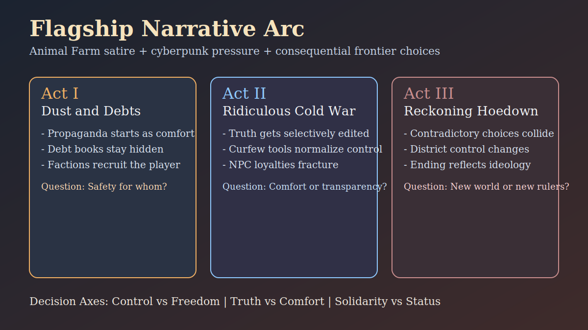
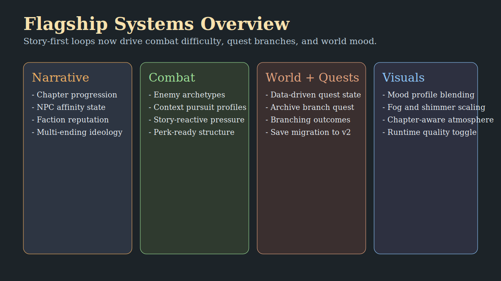
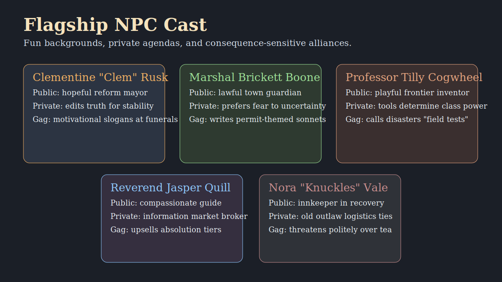

# WestWardRPG


Story-first open-world frontier RPG built on a custom Canvas raycasting stack.
No engine. No framework lock-in. Just readable systems code, deterministic helpers, and a growing RPG loop.

The current build pushes the original Shattered Frontier into a compact Skyrim/Oblivion-style direction: origins, attributes, regional identity, gear, armor, loot, workbench upgrades, housing utility, Boone's job board, deterministic NPC memory, combat payoff, and first-pass visual open-world pressure.

## Preview

▶ **Play in your browser:** [westward-rpg.vercel.app](https://westward-rpg.vercel.app) — runs entirely client-side, no install, no account.





## Table of Contents

- [Why This Project](#why-this-project)
- [Current State](#current-state)
- [Current Direction](#current-direction)
- [Core Systems](#core-systems)
- [Quick Start](#quick-start)
- [Controls](#controls)
- [Architecture](#architecture)
- [Developer Commands](#developer-commands)
- [Save Format & Migration](#save-format--migration)
- [Troubleshooting](#troubleshooting)
- [Contributing](#contributing)
- [License](#license)

## Why This Project

- Demonstrates a complete game loop from first principles (rendering, combat, AI, quests, persistence).
- Keeps complexity transparent by using modular plain JavaScript files.
- Treats narrative as gameplay logic, not only dialogue flavor.
- Uses automated tests for core systems and progression logic.
- Keeps future work in one roadmap: [`docs/roadmap.md`](docs/roadmap.md).

## Current State

`main` ships the Shattered Frontier v3 foundation plus several open-world RPG systems:

- **Story + payoff**: chapter progression, thematic axes, quest outcomes, final Lantern Revolt victory trigger, ending overlay, and run summary stats.
- **Combat depth**: enemy archetypes, status effects, perfect dodge/parry, parry chains, boss phase transitions, charge-cancel windup, weapon affixes, block chip, and guard break.
- **World life**: day/night cycle, region events, POIs, codex unlocks, faction reputation effects, weather, and region-specific mood.
- **Character identity**: title-screen origin selection, Might/Grit/Cunning/Craft/Speech/Lore, character sheet, role summary, and attribute hooks for pricing/gear/crafting.
- **Gear loop foundation**: weapon families, armor slots, deterministic loot tables, POI/mini-boss gear finds, earned gear visibility, and crafting-relevant resources.
- **Housing/workbench**: save-safe house workstation state, workbench levels, Workbench II potion/refine benefits, Workbench III map-table project, and selectable workbench actions.
- **Jobs/economy foundation**: Marshal Boone offers deterministic bounty, salvage, courier, patrol, supply-run, rescue, and escort work through in-world regional job boards with timed bonuses, failure/report-back states, regional job depth, route markers, minimap/HUD/debug visibility, progress tracking, and reward payout.
- **NPC memory foundation**: deterministic NPC memory for greetings, origin, region, house state, quest outcomes, faction stance, and gear milestones.
- **Visual feel foundation**: redesigned title screen, region visual identities, first-pass hit feedback, near-wall projection repair, and early Phase A open-world pressure/dressing work.

Latest local fast gate: `npm test` reports **538 passing tests across 52 files**. Run the verification commands below before committing gameplay changes.

## Current Direction

The detailed roadmap lives in [`docs/roadmap.md`](docs/roadmap.md), which is the single source of truth. The active build order is:

1. **Phase A: Visual open-world feel + first-minute pressure** — landmarks, roads, props, readable enemy intent, HUD clarity, nearby early reward/threat.
2. **Phase B: Narrative payoff + visible consequence** — quest outcome smoke, companion barks, NPC/town reactions, visible service changes.
3. **Phase C: RPG loops** — deeper gear choices, crafting stations, housing utility, economy jobs, bounties, and route-marker polish.
4. **Phase D: NPC life + local conversation** — handcrafted memory-aware dialogue first; optional LLM boundary later with offline fallback.
5. **Phase E: Playtest readiness** — pause/save slots/recovery, replay hooks, local metrics, and distribution packaging.

## Core Systems

- **Regions**
  - *Dustward Frontier* — town circle, marsh road, watchtower hints, ranch/house identity.
  - *Ashfall Basin* — sandstorms, heatwaves, slag towers, scrap-tier resources (`Ashglass`, `Scrap Coil`, `Heat Resin`).
  - *Iron Lantern District* — neon rain, surveillance pressure, signal-tier resources (`Lantern Filament`, `Cipher Lens`, `Pressurized Ink`).
- **Progression**
  - Skill branches (`survival`, `combat`, `influence`), weapon tiers (`Common` -> `Refined` -> `Relic`), weapon families, armor slots, affixes, and ideology traits.
- **Utilities**
  - Quick utility slot with `smoke`, `flare`, and `tonic`; dodge step; charged attack; block/parry tools.
- **Accessibility/graphics**
  - Graphics presets, colorblind palettes, motion/camera shake settings, high contrast support, font scaling, and render helpers.
- **Automation**
  - Unit tests, TypeScript checks, syntax checks, smoke actions, visual-regression capture scripts, and `render_game_to_text()` for deterministic browser/state inspection.

## Quick Start

```bash
git clone https://github.com/coleyrockin/WestWardRPG.git
cd WestWardRPG
npm install
npm run dev          # Vite dev server with HMR on port 5173
```

Then open [http://localhost:5173](http://localhost:5173).

For a production build:

```bash
npm run build        # outputs to dist/
npm run preview      # serves the built bundle on port 4173
```

Fallback static server (no build, no HMR — useful for quick spot-checks):

```bash
npm run dev:py       # python3 -m http.server 5173
```

If port `5173` is already used on your machine, Vite will automatically pick the next available port.

## Controls

- Move: `W` `A` `S` `D` or arrow keys
- Look: mouse (pointer lock) or `ArrowLeft` / `ArrowRight`
- Attack: left mouse or `Space`
- Block: right mouse or `C`
- Interact: `E` or `Enter`
- Use potion: `Q`
- Toggle map: `M`
- Toggle sound: `N`
- Toggle fullscreen: `F`
- Save / Load: `K` / `L`
- Recover after defeat: `R`
- Cycle visual quality: `V`
- Cycle graphics preset: `[` / `]`
- Cycle combat stance: `Z`
- Travel between unlocked regions: `G`
- Dodge step: `X`
- Charged attack: `B`
- Quick utility slot select: `1` (smoke) / `2` (flare) / `3` (tonic)
- Use quick utility: `U`

## Architecture

```text
WestWardRPG/
├── index.html
├── src/
│   ├── main.js              # orchestration loop + rendering + input
│   ├── constants.js         # tuning constants and static system values
│   ├── math.js              # shared math utilities
│   ├── decisionEngine.js    # chapters, axes, choices, ending resolution
│   ├── combatLoadout.js     # combat doctrines, perks, stance effects
│   ├── enemyArchetypes.js   # enemy families and combat profiles
│   ├── combatMilestones.js  # boss phases, parry chains, charged-attack helpers
│   ├── statusEffects.js     # burn/bleed/shock/frost runtime effects
│   ├── questDefinitions.js  # data-driven quest metadata/state helpers
│   ├── visualProfile.js     # atmosphere/quality + biome grading
│   ├── regionVisualIdentity.js # region mood, landmarks, props, identity lines
│   ├── gameFeel.js          # hit feedback and first-minute pressure helpers
│   ├── characterIdentity.js # origins, attributes, role summaries
│   ├── gearCrafting.js      # weapon families, armor, crafting economy hooks
│   ├── craftingStation.js   # house/workbench action resolution
│   ├── lootSystem.js        # deterministic loot tables and application
│   ├── jobBoard.js          # deterministic Boone jobs, route markers, rewards
│   ├── npcMemory.js         # deterministic NPC memory and reactive lines
│   ├── runSummary.js        # kill/resource/victory summary helpers
│   ├── progressionSystem.js # skill branches, weapon tiers, armor mods, traits
│   ├── regionSystem.js      # regions, weather pools, region events
│   ├── graphicsSettings.js  # presets, auto-detect, accessibility
│   ├── saveMigration.js     # v1/v2 -> v3 save migration
│   └── storyContent.js      # flagship dialogue and narrative flavor text
├── atmosphere.ts            # typed atmosphere model source
├── atmosphere.js            # browser-consumable atmosphere build
├── tests/                   # vitest system tests
├── test-actions/            # deterministic scripted behavior checks
├── docs/                    # flagship diagrams/screenshots
└── package.json
```

## Developer Commands

```bash
# Local run
npm run dev          # Vite dev server (HMR)
npm run dev:py       # Static-server fallback (python3, no build, no HMR)

# Build
npm run build        # Production bundle → dist/
npm run preview      # Serve the built bundle locally

# Verification (also runs in CI on every PR)
npm test
npm run typecheck:ts
npm run test:syntax
npm run dev:lint
npm run test:coverage
npm run test:smoke
npm run qa

# Optional visual capture
WESTWARD_PORT=5183 scripts/visual_regression_capture.sh
```

## Save Format & Migration

Saves live in `localStorage` under the `westward-save-v3` key. Legacy keys (`westward-save-v2`, `westward-save-v1`, `dustward-save-v1`) are read and migrated forward. The on-disk schema version field tracks compatibility:

| Version | Adds                                                                     |
| ------- | ------------------------------------------------------------------------ |
| `1`     | Original flagship payload (player, inventory, quests, house, world).     |
| `2`     | Narrative state (chapters, axes, decisions, NPC reactions).              |
| `3`     | Progression, regions, graphics, quick utility, expansion quests, gear, workstations, jobs, and NPC memory backfills. |

`migrateSaveToV3` upgrades v1/v2 payloads on load — old saves remain playable. Unknown or malformed payloads currently fall back to a fresh world; the roadmap tracks future corruption-recovery UI, backup rotation, and export/import work.

## Troubleshooting

- **Wrong app appears on localhost**: another process is using `5173`; run on `5183`.
- **No audio at start**: click canvas first to unlock browser audio context.
- **QA creates local artifacts**: smoke and visual checks write to ignored `output/`; remove it when you want a clean workspace.
- **Roadmap seems ahead of README**: use [`docs/roadmap.md`](docs/roadmap.md) as the detailed current plan; this README is the high-level project entry point.

## Contributing

See [`CONTRIBUTING.md`](CONTRIBUTING.md).

## License

MIT License — see [`LICENSE`](LICENSE).
