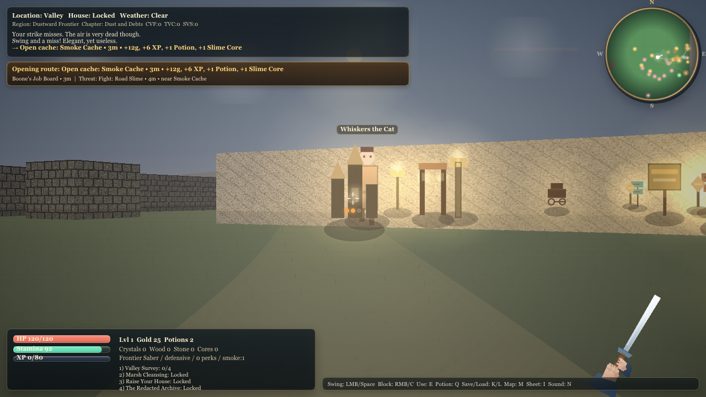
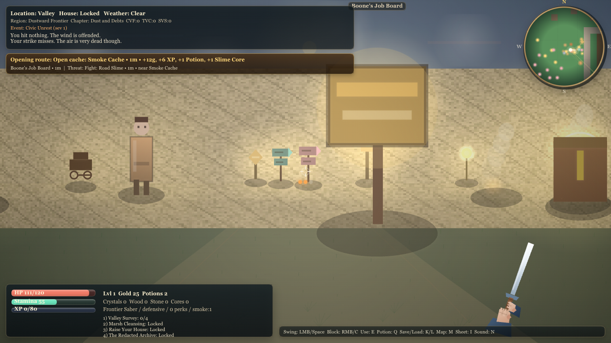
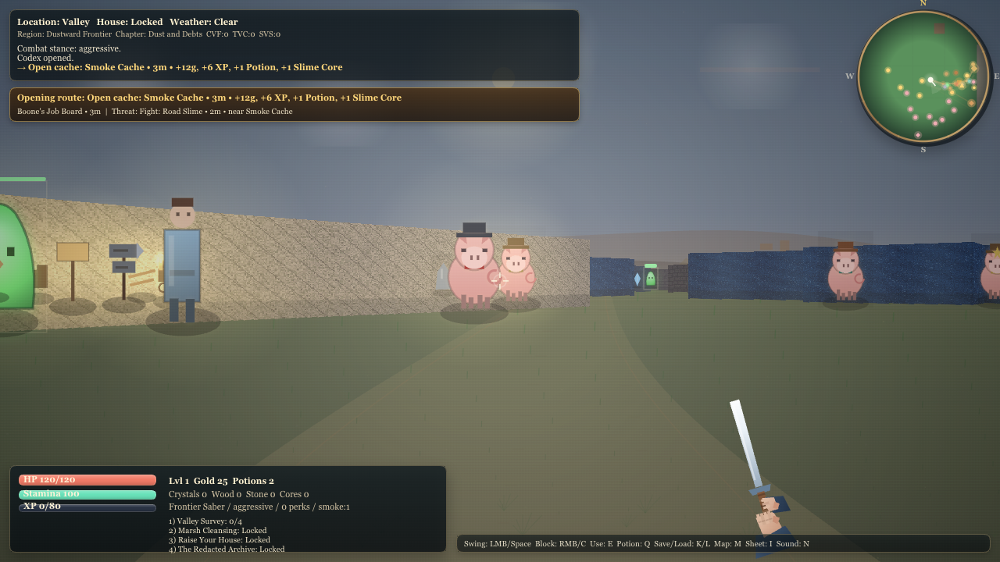
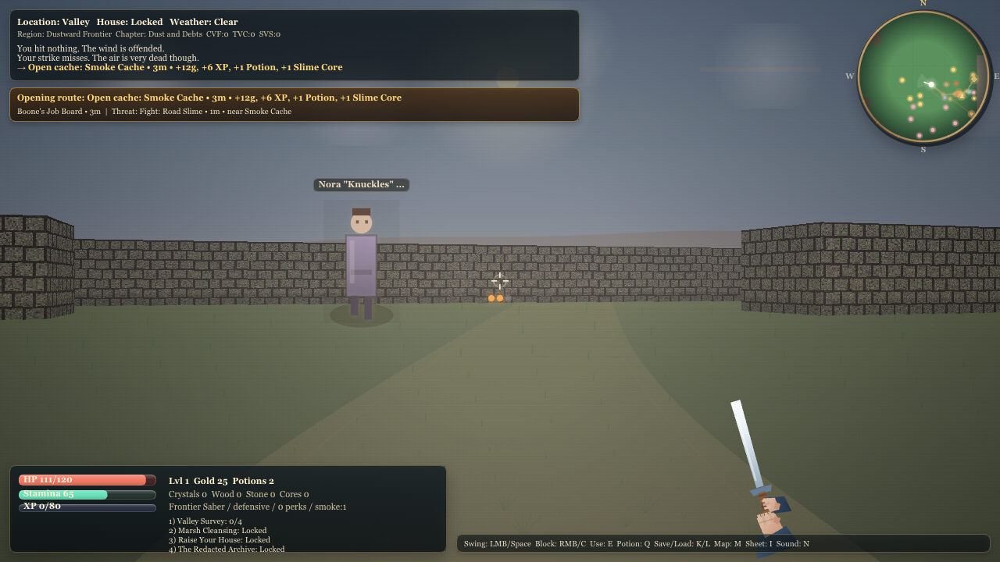

# WestWard


Story-first browser frontier RPG built on a custom Canvas raycasting stack, deterministic gameplay systems, and a growing Three.js renderer spike.

The current build pushes the original Shattered Frontier into a compact Skyrim/Oblivion-style direction with a new visual target: a stylized dark western RPG, closer to *Oblivion meets Weird West meets a low-poly graphic novel*. The Canvas game is the playable reference build; `spikes/render3d.html` is the in-progress 3D first-road slice.

## Preview

▶ **Play in your browser:** [westward-rpg.vercel.app](https://westward-rpg.vercel.app) — runs entirely client-side, no install, no account.

📦 **Download the offline build:** [latest release](https://github.com/coleyrockin/WestWardRPG/releases/latest) — unzip and double-click `index.html`, no server required.







## Table of Contents

- [Why This Project](#why-this-project)
- [Reviewer Quick Path](#reviewer-quick-path)
- [Current State](#current-state)
- [Current Direction](#current-direction)
- [MVP Test Path](#mvp-test-path)
- [Core Systems](#core-systems)
- [Quick Start](#quick-start)
- [Controls](#controls)
- [Architecture](#architecture)
- [Developer Commands](#developer-commands)
- [Release Readiness](#release-readiness)
- [Save Format & Migration](#save-format--migration)
- [Troubleshooting](#troubleshooting)
- [Contributing](#contributing)
- [License](#license)

## Why This Project

- Demonstrates a complete game loop from first principles (rendering, combat, AI, quests, persistence).
- Keeps complexity transparent by using modular plain JavaScript files.
- Treats narrative as gameplay logic, not only dialogue flavor.
- Uses automated tests for core systems and progression logic.
- Keeps future work in one roadmap: [`docs/roadmap.md`](docs/roadmap.md).

## What Reviewers Should Notice

- **Playable now**: the Canvas build has a full Dustward first-road loop with Boone's board, bounty flow, rewards, save recovery, and run memory.
- **Engineering depth**: 107 Vitest files cover combat, saves, jobs, progression, visual profiles, accessibility settings, and the 3D spike seams.
- **Browser QA discipline**: Playwright smoke scripts exercise golden-path, save-recovery, combat, weather, settings, and the Three.js first-road route.
- **Clear migration path**: the Three.js renderer is isolated under `src/render3d/`, with the Canvas game kept stable until parity is proven.

## Reviewer Quick Path

Use Node.js 22, which matches CI.

```bash
npm ci
npm run dev
```

Open the printed Vite URL, start in Dustward Frontier, then play the first-road loop:

1. Find Marshal Boone's job board.
2. Follow **Marsh Slime Bounty** toward Smoke Cache.
3. Inspect **Broken Wagon** for Map Scrap.
4. Return through Boone, Old Road Survey, and the house/workbench proof.

For confidence before review:

```bash
npm test
npm run typecheck:ts
npm run test:syntax
npm run dev:lint
npm run build
```

## Current State

The current build contains the Shattered Frontier v3 foundation plus several open-world RPG systems:

- **Story + payoff**: chapter progression, thematic axes, quest outcomes, final Lantern Revolt victory trigger, ending overlay, and run summary stats.
- **Combat depth**: enemy archetypes, status effects, perfect dodge/parry, parry chains, boss phase transitions, charge-cancel windup, weapon affixes, block chip, and guard break.
- **World life**: day/night cycle, region events, POIs, codex unlocks, faction reputation effects, weather, and region-specific mood.
- **Character identity**: title-screen origin selection, Might/Grit/Cunning/Craft/Speech/Lore, character sheet, role summary, and attribute hooks for pricing/gear/crafting.
- **Gear loop foundation**: weapon families, armor slots, deterministic loot tables, POI/mini-boss gear finds, earned gear visibility, and crafting-relevant resources.
- **Housing/workbench**: save-safe house workstation state, workbench levels, Workbench II potion/refine benefits, Workbench III map-table project, and selectable workbench actions.
- **Jobs/economy foundation**: Marshal Boone offers deterministic bounty, salvage, courier, patrol, supply-run, rescue, and escort work through in-world regional job boards with timed bonuses, failure/report-back states, regional job depth, route markers, minimap/HUD/debug visibility, progress tracking, and reward payout.
- **Golden path road loop**: Marsh Slime Bounty now flows into Broken Wagon, Map Scrap, and Old Road Survey, surfacing route, landmark, threat, authored checkpoint progress, crafting reward, NPC/board reaction, house proof, and run-summary memory.
- **NPC memory foundation**: deterministic NPC memory for greetings, origin, region, house state, quest outcomes, faction stance, and gear milestones.
- **Visual direction**: redesigned title screen, region visual identities, combat feedback, and an active Dustward Canvas art-kit pass with dusk sky, warmer road language, town silhouettes, lantern/wanted-board props, lower marsh barriers, and less placeholder-heavy opening composition.

Latest local fast gate: `npm test` reports **1174 passing tests across 107 files**. The core systems are present; the current roadmap is focused on turning them into a finished-product vertical slice. Run the verification commands below before committing gameplay changes.

## Current Direction

> **Active next direction: a renderer rewrite spike.** WestWard is migrating its
> presentation layer to a **Three.js** engine for richer scene depth, lighting,
> and characters. The current Canvas build is the **reference build** — it stays
> the playable source of truth for shipped gameplay until the new renderer proves
> the same first-road slice. The spike lives behind the `spikes/render3d.html` dev route
> (`npm run dev` → open `/spikes/render3d.html`) and does not touch the Canvas game. See
> [`docs/roadmap.md`](docs/roadmap.md).

Current playable path:

- `index.html` is the current playable/reference RPG build.
- `spikes/render3d.html` is an experimental Three.js first-road slice.
- New 3D work should stay under `src/render3d/` until it reaches parity with the Canvas first-road loop.

Active competition branch: `first-five-minutes-polish-v1` focuses on camera feel and gameplay readability. It keeps the exploration camera in a third-person RPG range, preserves smooth follow motion, adds a player readability ring/marker, fades blocking foreground props, and gives Boone's board an in-world path/target guide.

The detailed roadmap lives in [`docs/roadmap.md`](docs/roadmap.md), which is the single source of truth. The high-level active build order is:

1. **3D foundation hardening** — keep Canvas stable while the Three.js spike becomes modular, testable, and smoke-gated.
2. **First-road 3D loop** — finish the board, cache, slime, wagon, Map Scrap, and return-to-Boone sequence in `spikes/render3d.html`, with the first 30 seconds clearly framing the player, road, and Boone's board.
3. **Visual and accessibility proof** — add screenshot review, HUD readability, prompt semantics, and modal focus polish.
4. **System parity planning** — design the safe bridge from 3D phase completions back to save-safe Canvas systems.
5. **Release polish** — package the strongest playable path honestly, with known limits and current screenshots.

## MVP Test Path

For a portfolio-ready MVP review, use the first-road vertical slice:

1. Start in Dustward Frontier and find Marshal Boone's job board.
2. Accept **Marsh Slime Bounty** and follow the road/marker toward the marsh threat.
3. Inspect **Broken Wagon** to earn **Map Scrap** and reveal why the road matters.
4. Complete the bounty, return to Boone, then take **Old Road Survey**.
5. Mark the three survey checkpoints, claim the reward, and check the house/workbench proof.
6. Review the run summary and NPC/job-board reactions for first-road memory payoff.

MVP launch options:

```bash
npm install
npm run dev
```

For offline handoff, run:

```bash
npm run package:itch
```

That writes `releases/westward-rpg-offline-v1.0.0.zip`; unzip it and open
`index.html`. Known MVP limits: visuals still need human-approved baselines,
the first road is the strongest authored loop, and broader region/pet/LLM
expansion is intentionally post-MVP.

## Core Systems

- **Regions**
  - *Dustward Frontier* — town circle, marsh road, watchtower hints, ranch/house identity.
  - *Ashfall Basin* — sandstorms, heatwaves, slag towers, scrap-tier resources (`Ashglass`, `Scrap Coil`, `Heat Resin`).
  - *Iron Lantern District* — neon rain, surveillance pressure, signal-tier resources (`Lantern Filament`, `Cipher Lens`, `Pressurized Ink`).
- **Progression**
  - Skill branches (`survival`, `combat`, `influence`), weapon tiers (`Common` -> `Refined` -> `Relic`), weapon families, armor slots, affixes, and ideology traits.
- **Utilities**
  - Quick utility slot with `smoke`, `flare`, and `tonic`; dodge step; charged attack; block/parry tools.
- **Accessibility/graphics**
  - Graphics presets, colorblind palettes, motion/camera shake settings, high contrast support, font scaling, render helpers, and opt-in WebGL2 post-process layer (vignette + color grade).
- **NPC AI**
  - Townspeople driven by a minimal behavior-tree runtime (day: wander; dusk/night: return home). BT nodes are plain objects — JSON-safe, hot-reloadable.
- **Faction influence maps**
  - Per-region, per-faction influence coefficients derived from rep scores modulate hostile spawn density and route-marker tinting.
- **Run history + playtest metrics**
  - Last 10 completed runs persisted locally. Tracks time-to-first-kill, time-to-first-job-accepted, chapter reached, death cause, and setting changes per run.
- **Automation**
  - Unit tests, TypeScript checks, syntax checks, smoke actions, visual-regression capture/review scripts, and `render_game_to_text()` for deterministic browser/state inspection. Strict visual diff is intentionally blocked until baselines are committed.

## Quick Start

```bash
git clone https://github.com/coleyrockin/WestWardRPG.git
cd WestWardRPG
npm ci
npm run dev          # Vite dev server with HMR (default `127.0.0.1:5180` from `vite.config.js`)
```

Then open [http://127.0.0.1:5180](http://127.0.0.1:5180) (or the exact Vite output URL).

For a production build:

```bash
npm run build        # outputs to dist/
npm run preview      # serves the built bundle on port 4173
```

For an offline-playable ZIP (itch.io style — runs by double-clicking
`index.html`, no server, no install):

```bash
npm run package:itch  # writes releases/westward-rpg-offline-v<version>.zip
```

If port `5180` is already in use, Vite will automatically pick the next available port.

## Controls

- Move: `W` `A` `S` `D` or arrow keys
- Look: mouse (pointer lock) or `ArrowLeft` / `ArrowRight`
- Attack: left mouse or `Space`
- Block: right mouse or `C`
- Interact: `E` or `Enter`
- Use potion: `Q`
- Toggle map: `M`
- Toggle sound: `N`
- Toggle fullscreen: `F`
- Save / Load: `K` / `L`
- Recover after defeat: `R`
- Cycle visual quality: `V`
- Cycle graphics preset: `[` / `]`
- Cycle combat stance: `Z`
- Travel between unlocked regions: `G`
- Dodge step: `X`
- Charged attack: `B`
- Quick utility slot select: `1` (smoke) / `2` (flare) / `3` (tonic)
- Use quick utility: `U`

## Architecture

```text
WestWard/
├── index.html                  # Canvas RPG entry (shipped)
├── spikes/
│   └── render3d.html           # Three.js first-road slice (in-progress)
├── src/
│   ├── main.js                 # composition root: state, system wiring, loop
│   ├── devOverlayPayload.js    # window.render_game_to_text() JSON assembly
│   ├── input.js                # pointer/mouse/blur/fullscreen handlers
│   ├── ui/
│   │   ├── controlsDisclosure.js  # title-screen controls reveal (loaded by index.html)
│   │   └── serviceWorkerRegister.js  # SW registration + update prompt
│   ├── render3d/                # Three.js renderer spike (entry: spikes/render3d.html)
│   ├── constants.js             # tuning constants and static system values
│   ├── math.js                  # shared math utilities
│   ├── decisionEngine.js        # chapters, axes, choices, ending resolution
│   ├── combatLoadout.js         # combat doctrines, perks, stance effects
│   ├── enemyArchetypes.js       # enemy families and combat profiles
│   ├── combatMilestones.js      # boss phases, parry chains, charged-attack helpers
│   ├── statusEffects.js         # burn/bleed/shock/frost runtime effects
│   ├── questDefinitions.js      # data-driven quest metadata/state helpers
│   ├── visualProfile.js         # atmosphere/quality + biome grading
│   ├── regionVisualIdentity.js  # region mood, landmarks, props, identity lines
│   ├── gameFeel.js              # hit feedback and first-minute pressure helpers
│   ├── characterIdentity.js     # origins, attributes, role summaries
│   ├── gearCrafting.js          # weapon families, armor, crafting economy hooks
│   ├── craftingStation.js       # house/workbench action resolution
│   ├── lootSystem.js            # deterministic loot tables and application
│   ├── jobBoard.js              # deterministic Boone jobs, route markers, rewards
│   ├── npcMemory.js             # deterministic NPC memory and reactive lines
│   ├── runSummary.js            # kill/resource/victory summary helpers
│   ├── progressionSystem.js     # skill branches, weapon tiers, armor mods, traits
│   ├── regionSystem.js          # regions, weather pools, region events
│   ├── graphicsSettings.js      # presets, auto-detect, accessibility, postFx toggle
│   ├── postProcess.js           # WebGL2 post-process layer (vignette + color grade)
│   ├── behaviorTree.js          # minimal BT runtime (sequence/selector/action/condition)
│   ├── npcBehaviors.js          # townsperson day-wander / dusk-return-home tree
│   ├── influenceMap.js          # faction influence coefficients → spawn density + tint
│   ├── runHistory.js            # localStorage-backed run history + playtest metrics
│   ├── fogOfWar.js              # 32×32 per-region fog grid; minimap reveals on movement
│   ├── sideJobGenerator.js      # side-job generator seeded by region + faction state
│   ├── wfcInteriors.js          # Wave Function Collapse cave/mine/ruin interior generator
│   ├── languagePacks.js         # locale strings used across localized copy
│   ├── gameState.d.ts           # GameState type hierarchy (PlayerState, NarrativeState…)
│   ├── saveMigration.js         # v1/v2 -> v3 save migration
│   ├── atmosphere.ts            # typed atmosphere model (single source — bundled by Vite)
│   └── storyContent.js          # flagship dialogue and narrative flavor text
├── tests/                       # vitest system tests
├── test-actions/                # deterministic scripted behavior checks
├── tools/
│   └── playwright-client.mjs    # smoke / visual-regression driver
├── docs/                        # flagship diagrams/screenshots/security review
└── package.json
```

## Developer Commands

```bash
# Local run
npm run dev          # Vite dev server (HMR)

# Build
npm run build        # Production bundle -> dist/
npm run preview      # Serve the built bundle locally

# Verification
npm test
npm run typecheck:ts
npm run test:syntax
npm run dev:lint
npm run test:smoke
npm run test:render3d # requires a running dev server, defaults to http://127.0.0.1:5180
npm run qa

# Visual capture + diff
npm run test:visual:capture
npm run test:visual:review
npm run test:visual # run after baselines are committed to enforce pixel thresholds
```

## Release Readiness

- **Web deployment**: Vercel builds with `npm run build` and serves `dist/`. `vercel.json` includes static caching and browser security headers.
- **Offline package**: `npm run package:itch` writes `releases/westward-rpg-offline-v1.0.0.zip`; the ZIP uses relative asset paths and can be opened directly from `index.html`.
- **Smoke proof**: `npm run test:smoke` writes ignored screenshots and JSON states under `output/qa-smoke-*`.
- **Visual baselines**: strict visual regression is intentionally not enforced until human-approved baselines are committed. Use `npm run test:visual:review` for review mode.
- **Known public-review limits**: the first Dustward road loop is the strongest authored slice; broader regions, pets, optional AI dialogue, and deeper economy are post-MVP roadmap items.

## Save Format & Migration

Saves live in **IndexedDB** (primary), with automatic backup rotation (last 3 backups per slot) and a one-time localStorage migration on first load. The storage envelope wraps every payload with a version, timestamp, and FNV-1a hash for corruption detection.

Three save slots are available on the title screen. Each slot shows level, region, time played, difficulty, recovery status, and backup availability. Export (↓), per-slot import (↑), global import, delete, and corrupt-slot recovery controls are on the slot picker. Corrupted saves can be restored from the latest valid backup, and multiple valid backups can be chosen manually.

The on-disk payload schema version field tracks compatibility:

| Version | Adds                                                                     |
| ------- | ------------------------------------------------------------------------ |
| `1`     | Original flagship payload (player, inventory, quests, house, world).     |
| `2`     | Narrative state (chapters, axes, decisions, NPC reactions).              |
| `3`     | Progression, regions, graphics, quick utility, expansion quests, gear, workstations, jobs, and NPC memory backfills. |

`migrateSaveToV3` upgrades v1/v2 payloads on load — old saves remain playable.

## Troubleshooting

- **Wrong app appears on localhost**: another process may be using the port; run smoke on an explicit URL, for example `WESTWARD_PORT=5211 WESTWARD_URL=http://127.0.0.1:5211/index.html npm run test:smoke`.
- **No audio at start**: click canvas first to unlock browser audio context.
- **QA creates local artifacts**: smoke and visual checks write to ignored `output/`; remove it when you want a clean workspace.
- **Roadmap seems ahead of README**: use [`docs/roadmap.md`](docs/roadmap.md) as the detailed current plan; this README is the high-level project entry point.

## Contributing

See [`CONTRIBUTING.md`](CONTRIBUTING.md).

## License

MIT License — see [`LICENSE`](LICENSE).
