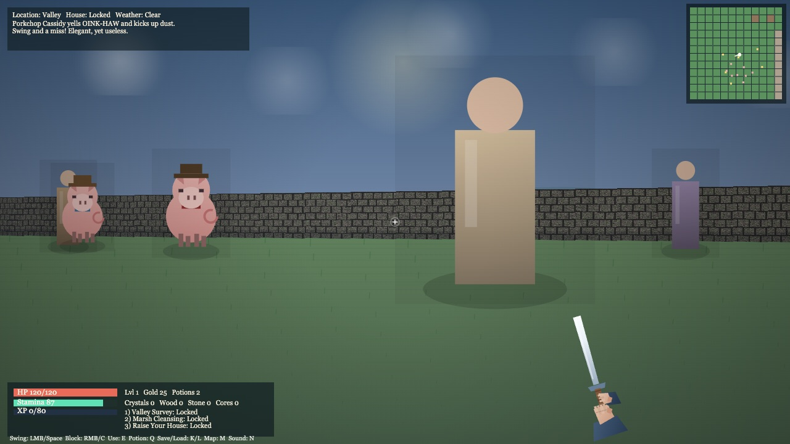
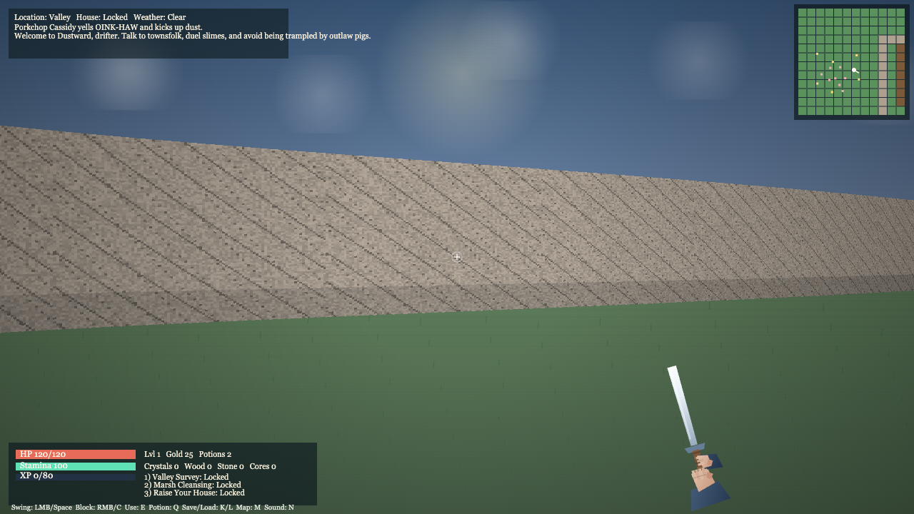
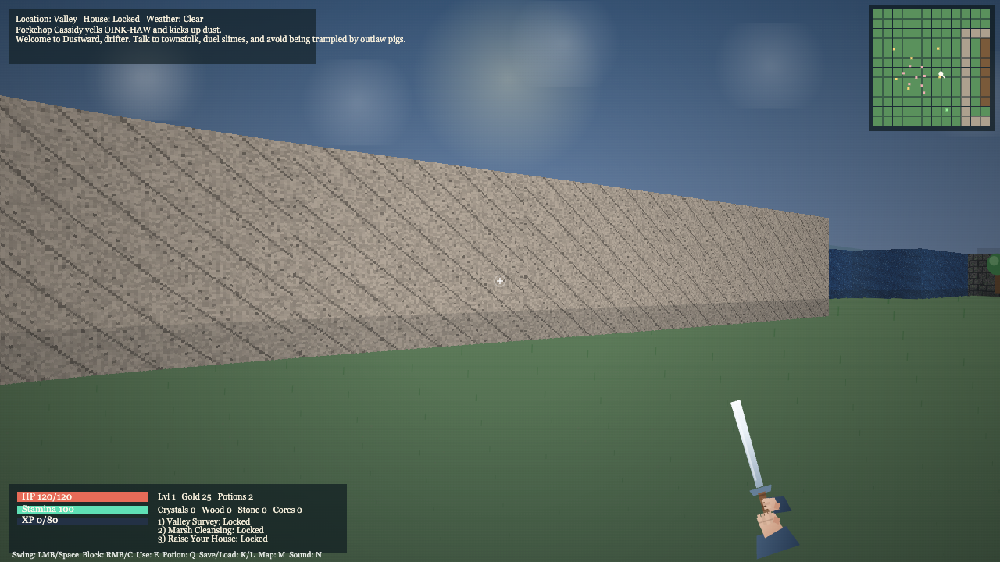

# WestWardRPG

[](https://developer.mozilla.org/en-US/docs/Web/JavaScript)
[](https://developer.mozilla.org/en-US/docs/Web/API/Canvas_API)
[](https://www.typescriptlang.org/)
[](https://playwright.dev/)
[](LICENSE)

> **A first-person browser RPG where steel clashes, quests chain together, and pigs occasionally steal the spotlight.**

WestWardRPG (in-game title: *Dustward*) is a fully browser-native, framework-free, first-person RPG sandbox. Built on raw HTML5 Canvas and vanilla JavaScript, it features a custom DDA raycast renderer, stamina-driven sword combat, a three-quest progression arc, dynamic weather, and an ensemble cast of western-themed NPC pigs — all playable at `http://localhost:5173` with a single `npm start`.

---

## Gameplay Preview

<p align="center">
  
</p>

<p align="center">
  
  
</p>

---

## Table of Contents

- [Features](#features)
- [Tech Stack](#tech-stack)
- [How It Works](#how-it-works)
- [Quick Start](#quick-start)
- [Controls](#controls)
- [Language Support](#language-support)
- [Testing & QA](#testing--qa)
- [Project Structure](#project-structure)
- [Roadmap](#roadmap)
- [Contributing](#contributing)

---

## Features

| Area | Details |
|---|---|
| **Rendering** | DDA raycast 3D renderer with procedural stone/water textures, fog, distance haze, and weather overlays |
| **Combat** | 3-hit sword combo, stamina pressure, timed blocking, hit stagger, knockback, and death/recovery flow |
| **Progression** | XP/level curve, gold economy, health potions, resource harvesting, loot chests |
| **Quests** | 3-step arc: *Valley Survey* → *Marsh Cleansing* → *Raise Your House* |
| **World** | Outdoor valley + enterable player house interior, day/night cycle, dynamic weather (clear/mist/rain/storm) |
| **NPCs & Pigs** | Interactive NPCs (elder, merchant, innkeeper, bard); 8 western pig roles with flocking AI and stampede behavior |
| **Save System** | Quick save/load (K/L), 30-second autosave, versioned localStorage with legacy migration |
| **Localization** | 8 languages with in-game selector; preference persisted in localStorage |
| **Automation** | Playwright-based scenario runner with deterministic hooks for CI/screenshot capture |

---

## Tech Stack

### Core Game
| Technology | Role |
|---|---|
| **JavaScript (ES2020)** | Game loop, raycast renderer, combat, AI, quest engine, save/load |
| **HTML5 Canvas** | Full-screen render target; all drawing done via the 2D context API |
| **CSS3** | Menu card, HUD overlays, responsive layout |
| **TypeScript** | Typed atmosphere math module (`atmosphere.ts`) compiled to `atmosphere.js` |

### Development Tooling
| Technology | Role |
|---|---|
| **Python 3** | Dev server (`http.server`), scenario state analysis (`scripts/state_report.py`) |
| **Go** | High-performance map data validation (`scripts/map_validator.go`) |
| **Rust** | Texture data processing and color analysis (`scripts/texture_analyzer.rs`) |
| **Ruby** | Asset manifest generation and integrity verification (`scripts/asset_bundler.rb`) |
| **Perl** | Log analysis and run statistics (`scripts/log_analyzer.pl`) |
| **PHP** | Web server config generation — nginx, Apache, Caddy (`scripts/config_generator.php`) |
| **Shell (Bash)** | Build pipeline, dependency checks, end-to-end smoke suite (`scripts/dev_tools.sh`, `scripts/smoke_suite.sh`) |
| **Playwright** | Automated gameplay scenario execution, screenshot capture, and state validation |

---

## How It Works

```
index.html          ← game shell, menu UI, language selector, canvas mount
  └── atmosphere.js ← compiled TypeScript: sky color math (day/night + storm blending)
  └── game.js       ← everything else (≈ 4 000 lines of vanilla JS)
        ├── Raycast Renderer   DDA wall casting, texture sampling, fog, sprite projection
        ├── World Maps         Indoor/outdoor tile maps; player collision; chest/door logic
        ├── Weather System     State machine (clear → mist → rain → storm); sky/fog/rain visuals
        ├── Combat Engine      Attack chains, stamina drain, block window, enemy pursuit AI
        ├── Quest Engine       Locked/active/complete/turned-in state per quest
        ├── NPC System         Roaming idle + dialogue, shop, inn, bard flavor
        ├── Pig AI             Flocking (separation/alignment/cohesion), stampede trigger, role behaviors
        ├── Save/Load          Versioned localStorage with validation, autosave, legacy migration
        └── i18n               Language pack lookup; locale persisted across sessions
```

The renderer runs inside a `requestAnimationFrame` loop. Each frame: advance time → simulate weather → move entities → cast rays → draw environment → project billboards → render HUD. The deterministic hooks (`window.advanceTime(ms)`, `window.render_game_to_text()`) expose game state as JSON for automated testing without a real browser frame clock.

---

## Quick Start

### Prerequisites

- [Node.js](https://nodejs.org/) 16+ (for `npm` and syntax checks)
- [Python 3](https://www.python.org/) (for the dev HTTP server)

### Install & Run

```bash
git clone https://github.com/coleyrockin/WestWardRPG.git
cd WestWardRPG
npm install
npm start
```

Open in your browser:

- **Primary:** [http://127.0.0.1:5173/index.html](http://127.0.0.1:5173/index.html)
- **Fallback:** [http://localhost:5173/index.html](http://localhost:5173/index.html)
- **IPv6:** [http://[::1]:5173/index.html](http://[::1]:5173/index.html)

No build step required. The game runs directly from source.

---

## Controls

| Action | Keys |
|---|---|
| Move | `W` `A` `S` `D` or Arrow keys |
| Look | Mouse (pointer lock) or `←` `→` |
| Attack | Left Mouse or `Space` |
| Block | Right Mouse or `C` |
| Interact / Shop | `E` or `Enter` |
| Use Potion | `Q` |
| Quick Save | `K` |
| Quick Load | `L` |
| Toggle Map | `M` |
| Toggle Sound | `N` |
| Fullscreen | `F` |
| Recover (after death) | `R` |

---

## Language Support

Select a language in the main menu. The choice is saved between sessions.

| Code | Language |
|---|---|
| `en` | English |
| `es` | Español |
| `pt` | Português |
| `fr` | Français |
| `de` | Deutsch |
| `it` | Italiano |
| `ja` | 日本語 |
| `tr` | Türkçe |

---

## Testing & QA

### One-Command QA Gate

```bash
npm run qa
```

Runs lint/type/syntax checks, then a multi-scenario functional smoke suite (movement, quest pathing, combat/block flow). Artifacts are saved to `output/qa-smoke-<timestamp>/`.

### Individual Commands

```bash
# Syntax check
npm test

# TypeScript type check
npm run typecheck:ts

# Scenario smoke suite only
npm run test:smoke

# Python state report from output snapshots
npm run report:states

# Full dev pipeline (check → lint → build → test)
npm run dev:full
```

### Playwright Scenario Example

```bash
node ./web_game_playwright_client.mjs \
  --url http://localhost:5173/index.html \
  --actions-file ./test-actions/quest_flow.json \
  --click-selector "#start-btn" \
  --iterations 2 \
  --pause-ms 250 \
  --screenshot-dir output/web-game-quest
```

Scenario files live in `test-actions/`. Each file is a JSON array of `{ type, key/x/y, duration }` action objects that the Playwright client replays deterministically.

---

## Project Structure

```
WestWardRPG/
├── index.html                    # Game shell: canvas, menu, language selector
├── game.js                       # Core engine (~4 000 lines): render, combat, AI, quests, saves
├── atmosphere.ts                 # TypeScript source: sky/atmosphere math module
├── atmosphere.js                 # Compiled output of atmosphere.ts (loaded by index.html)
├── web_game_playwright_client.mjs# Playwright automation runner
│
├── test-actions/                 # JSON action scripts for automated gameplay scenarios
│   ├── quest_flow.json
│   ├── combat_block_flow.json
│   ├── realism_smoke.json
│   └── ...
│
├── scripts/                      # Dev & deployment tooling (multi-language)
│   ├── dev_tools.sh              # Build pipeline and linting automation
│   ├── smoke_suite.sh            # End-to-end QA smoke runner
│   ├── state_report.py           # Python: analyze scenario snapshot output
│   ├── map_validator.go          # Go: validate map JSON structure
│   ├── texture_analyzer.rs       # Rust: texture data processing
│   ├── asset_bundler.rb          # Ruby: asset manifest generation
│   ├── log_analyzer.pl           # Perl: log statistics
│   ├── config_generator.php      # PHP: web server config generation
│   └── README.md                 # Detailed per-script usage docs
│
├── test-data/                    # Sample input files for Go/Rust scripts
├── docs/images/                  # Screenshots used in this README
│
├── CHANGELOG.md                  # Development history and milestone notes
├── ROADMAP.md                    # Planned features and future direction
├── CONTRIBUTING.md               # How to contribute
└── package.json                  # npm scripts and metadata
```

---

## Roadmap

See **[ROADMAP.md](ROADMAP.md)** for the full list of planned features, including:

- Sprite art pass for NPCs and enemies
- Expanded quest arc beyond house construction
- GitHub Pages live demo deployment
- Mobile / touch control support
- TypeScript migration of `game.js`

---

## Contributing

See **[CONTRIBUTING.md](CONTRIBUTING.md)** for setup instructions, coding guidelines, and how to run scenarios before opening a pull request.

Bug reports and feature suggestions are welcome via [GitHub Issues](https://github.com/coleyrockin/WestWardRPG/issues).

---

## Why This Project

WestWardRPG demonstrates that a compelling, fully featured game experience can be built using nothing but platform-native web APIs — no game engine, no UI framework, no build step required. Every system (renderer, physics, AI, weather, localization) is written from scratch and visible in a single `game.js` file, making the codebase unusually readable and educational for anyone wanting to understand how 3D browser games work under the hood.
